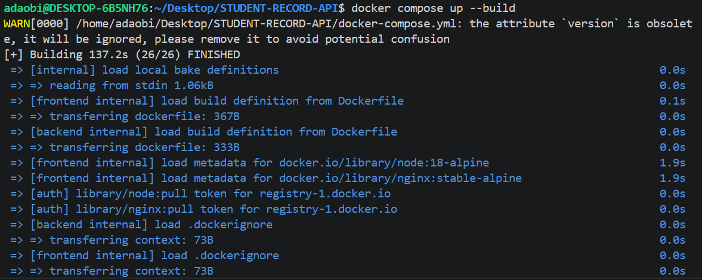
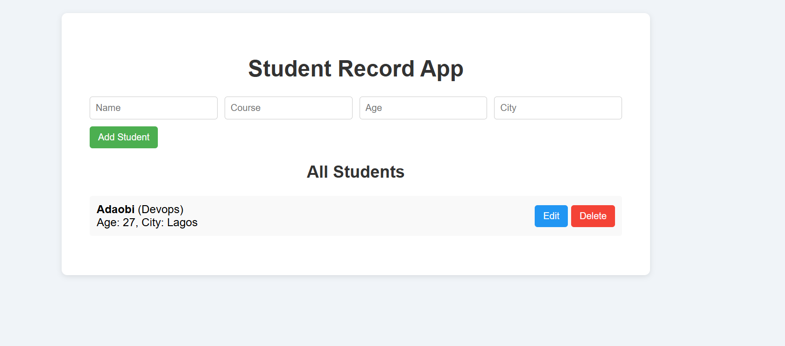
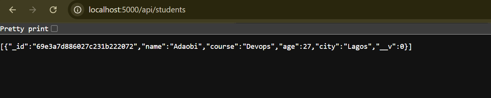
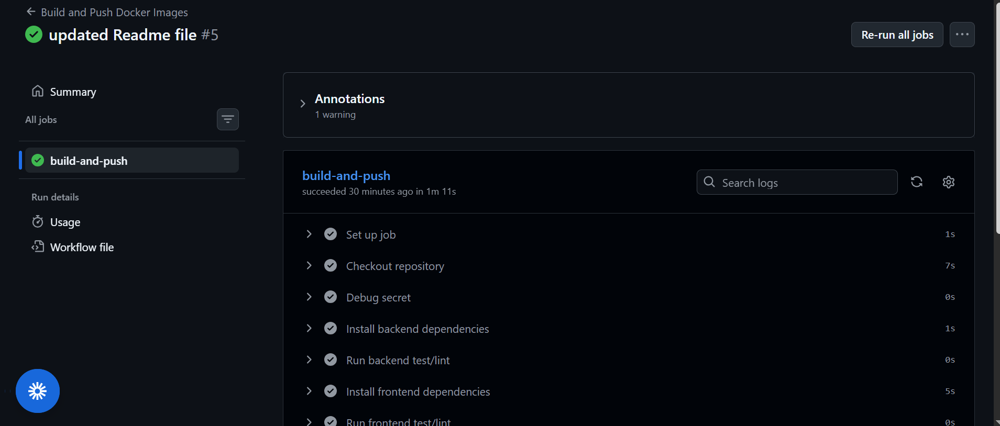
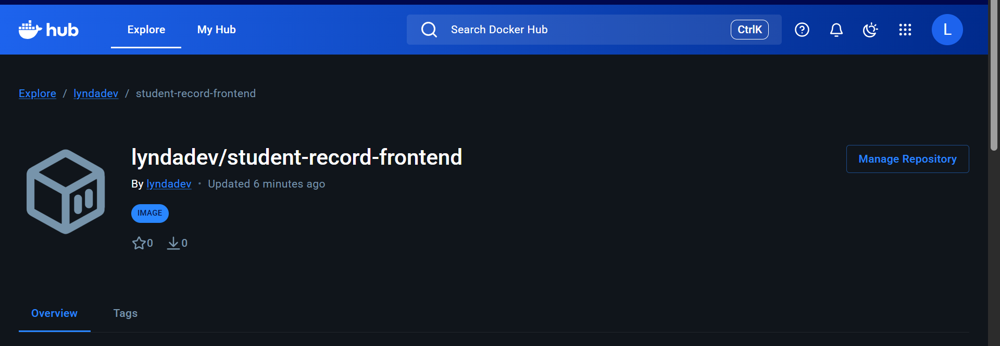
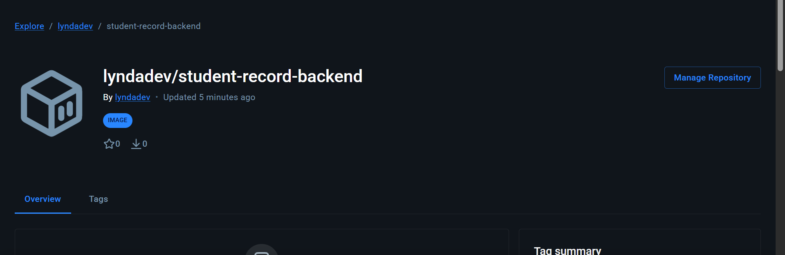

## How Image Tags Are Generated

Each image is pushed with **two tags** on every successful run:

| Tag | Value | Purpose |
|-----|-------|---------|
| `latest` | always `latest` | Points to the most recent build from `main` |
| `<commit sha>` | unique identifer for each version  (e.g. `a3f9c12`) | Immutable, pinned to the exact commit |

This is handled by [`docker/metadata-action`](https://github.com/docker/metadata-action):


## 🏷️ Docker Image Tagging Strategy

Each image is tagged with:

* **latest**

  * Always points to the most recent build

* **commit SHA**

  * Unique identifier for each version

### Example:

```
student-record-backend:latest
student-record-backend:abc1234
```
### 🎯 Benefits

* Track deployments easily
* Rollback to previous versions
* Maintain version history.

---

## 🧩 Docker Compose Setup

**File:** `docker-compose.yml`

### Services:

### 1. Backend

* Builds from `./backend`
* Runs on port `5000`
* Connects to MongoDB

### 2. Frontend

* Builds from `./frontend`
* Runs on port `3000`
* Depends on backend

### 3. MongoDB

* Uses official `mongo` image
* Stores data using Docker volumes

---
## ▶️ Running the App Locally

```bash
docker compose up --build
```

Access:

* Frontend → http://localhost:3000

* Backend → http://localhost:5000/api/students

---

## 🔁 CI/CD Pipeline (GitHub Actions)

**File:** `.github/workflows/docker-build.yml`

### Trigger:

* Runs on every push to `main`

---




## Repository in Docker Hub
### Frontend Repository

[hub.docker.com/r/lyndadev/student-record-frontend](hub.docker.com/r/lyndadev/student-record-frontend)


### Backend Repository

[hub.docker.com/r/lyndadev/student-record-backend](hub.docker.com/r/lyndadev/student-record-backend)

## ✅ Summary of Work Done

* Created Dockerfiles for frontend and backend
* Used Nginx for production-ready frontend serving
* Built CI pipeline for automated image build and push
* Implemented tagging strategy (`latest` + commit SHA)

## Author
Adaobi Okwuosa


